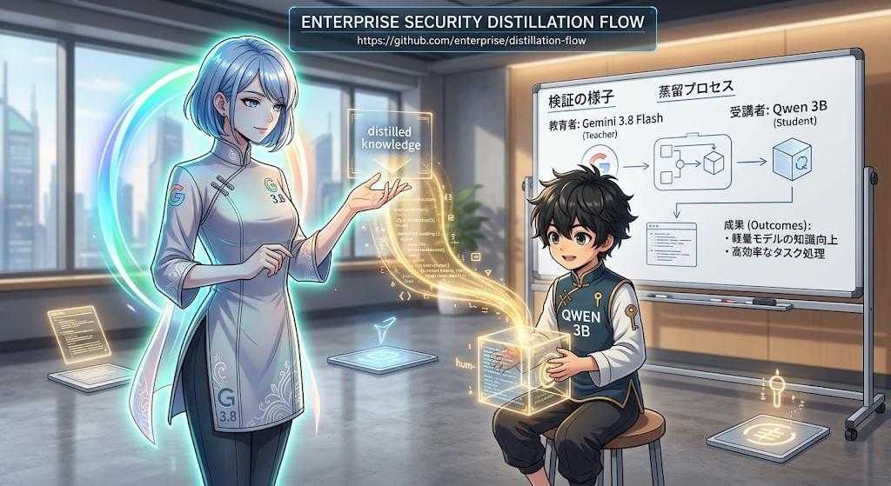
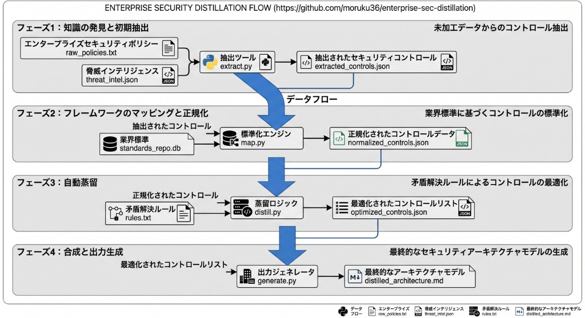

# Enterprise Security LLM Distillation (Gemini 3.8 Flash -> Qwen2.5-3B)



エンタープライズ環境におけるサイバーセキュリティ防御に特化した、**Teacher-generated Synthetic Data Distillation（合成データによる指示チューニング / 蒸留）** の技術検証リポジトリです。

フロンティアモデル（Teacher: **Gemini 3.8 Flash**）から実践的な防御手順・ログ解析・設定指示の問答ペアを合成抽出し、ローカルの小型オープンモデル（Student: **Qwen2.5-3B-Instruct**）へ **QLoRA (4-bit)** を用いて知識を転移。マージおよび **GGUF (Q8_0)** 変換を経て、ローカル環境（**Ollama**）での実行および多軸ベンチマーク評価を行います。

> [!NOTE]
> **Inspiration / Acknowledgment**:  
> 本検証は、[@furuhashilab](https://github.com/furuhashilab) 氏による [KnowledgeDistillation2026](https://github.com/furuhashilab/KnowledgeDistillation2026) に着想を得て、エンタープライズセキュリティ防御領域への適用・再現性向上を目的として実施されました。

---

## 1. TL;DR

- **手法**: Teacherモデル（Gemini 3.8 Flash）による高品質合成データ生成 ＋ QLoRA (4-bit) 指示チューニング ＋ GGUF (Q8_0) ローカル配備
- **対象ドメイン**: SOC/SIEM/EDR、ゼロトラスト/IAM、インシデント対応、クラウドセキュリティ、境界防御
- **計算資源**: 単一コンシューマGPU（NVIDIA GeForce RTX 3070 8GB VRAM）で完結
- **主結果**:
  - 小型モデル（3B）でありながら、一般的な概念論にとどまっていたベースモデルに対し、実務コマンド（PowerShell, AWS CLI, KQL等）を即座に提示する具体性が大幅に向上。
  - 一方で、小型モデル特有の「堂々としたハルシネーション（非実在コマンドの生成や設定の誤認）」も観察され、小型モデルの現場適用におけるファクトチェックとプロンプトガードレールの重要性が浮き彫りとなりました。

---

## 2. アーキテクチャ & データフロー



```text
┌────────────────────────────────────────────────────────────────────────┐
│ Phase 1: 知識抽出 & データセット生成 (Teacher: Gemini 3.8 Flash)        │
│  - 5カテゴリのセキュリティ防御シナリオをスキーマ検証付きで生成           │
│  - プロベナンスメタデータ (モデル・生成日時・検証ステータス) を付与      │
│  - 出力: `data/raw/` (生データ) ➔ `data/train.jsonl`                   │
└──────────────────────────────────┬─────────────────────────────────────┘
                                   │
┌──────────────────────────────────▼─────────────────────────────────────┐
│ Phase 2: QLoRA 指示チューニング (Student: Qwen2.5-3B-Instruct)          │
│  - 4-bit NF4 量子化 + PEFT (rank=16, alpha=32)                         │
│  - ChatML 形式にテンプレート適用 (`src/train_lora.py`)                   │
│  - 出力: `models/lora_adapter`                                         │
└──────────────────────────────────┬─────────────────────────────────────┘
                                   │
┌──────────────────────────────────▼─────────────────────────────────────┐
│ Phase 3: 重みマージ & GGUF (Q8_0) 量子化                                │
│  - ベースモデルとLoRAをCPU/GPUでマージ (`src/merge_lora.py`)            │
│  - llama.cpp により GGUF (Q8_0) 変換 ➔ Ollama ローカル配備             │
└──────────────────────────────────┬─────────────────────────────────────┘
                                   │
┌──────────────────────────────────▼─────────────────────────────────────┐
│ Phase 4: 多軸評価ベンチマーク (`src/evaluate.py`)                       │
│  - 未学習シナリオ 10 問 (`data/eval.jsonl`) によるブラインド比較       │
│  - 比較対象: ベースモデル (Qwen2.5-3B) vs 蒸留モデル (sec-defense:3B)  │
│  - 評価軸: ①具体性 ②実務適合性 ③正確性・ハルシネーション検証         │
└────────────────────────────────────────────────────────────────────────┘
```

---

## 3. Quick Start

### 前提条件
- Python 3.10+
- NVIDIA GPU（VRAM 8GB以上推奨）※推論・評価のみならCPU環境やOllamaのみでも実行可能
- [Ollama](https://ollama.com/)（ローカル推論検証を行う場合）

### セットアップ
```bash
git clone https://github.com/moruku36/enterprise-sec-distillation.git
cd enterprise-sec-distillation

# 仮想環境の作成と依存関係のインストール
python -m venv .venv
source .venv/bin/activate  # Windows: .venv\Scripts\activate
pip install -r requirements.txt

# 環境変数の設定 (データセット生成時のみ必要)
cp .env.example .env
# .env 内の GEMINI_API_KEY を設定
```

### テスト実行 (スキーマ検証 & スモークテスト)
```bash
python -m unittest discover -s tests -v
```

---

## 4. データセット & プロベナンス (Dataset & Provenance)

データセットは以下の5領域から実務的なインシデントシナリオを網羅するように設計されています。

| カテゴリ | 対象スコープ |
| :--- | :--- |
| `soc_siem_edr` | アラートトリアージ、EDR隔離判断、Microsoft Sentinel (KQL) / Splunk (SPL) クエリ |
| `zero_trust_iam` | Entra ID / Okta条件付きアクセス、最小権限、PAM、Pass-the-Hash / Kerberoasting対策 |
| `incident_response` | ランサムウェア初動対応、動的証拠保全 (Live Response)、C2遮断、MITRE ATT&CK連携 |
| `cloud_security` | AWS (GuardDuty, IAM, IMDSv2), Azure (Defender, Storage Private Endpoint, NSG) |
| `network_perimeter` | DNSトンネリング検知、RPZシンクホール化、SSL-VPN脆弱性対応、マイクロセグメンテーション |

### データ構造と監査性 (Provenance)
生成スクリプト（`src/generate_dataset.py`）により、すべてのレコードに生成元モデル・生成日時・バリデーションステータスが付与されます。
```json
{
  "instruction": "社内Active Directory環境に対するKerberoasting攻撃を検知するKQLクエリを作成してください。",
  "input": "ログソース: SecurityEvent (Event ID 4769), 暗号化タイプ: 0x17",
  "output": "【1. 検知用KQLクエリ】\nSecurityEvent | where EventID == 4769 ...",
  "category": "soc_siem_edr",
  "teacher_model": "gemini-3.8-flash",
  "generated_at": "2026-09-17T06:13:00Z",
  "prompt_version": "v1.0",
  "validation_status": "passed"
}
```

- 生成実行コマンド:
  ```bash
  python src/generate_dataset.py --model gemini-3.8-flash --count_per_cat 5 --output data/train.jsonl
  ```

---

## 5. 学習 (QLoRA Fine-Tuning)

VRAM 8GB（RTX 3070）環境で効率的に学習するため、BitsAndBytes 4-bit NF4 量子化と LoRA を組み合わせています。

- **Base Model**: `Qwen/Qwen2.5-3B-Instruct`
- **LoRA設定**: `r=16`, `lora_alpha=32`, `target_modules=["q_proj", "k_proj", "v_proj", "o_proj"]`
- **シーケンス長**: 1,536 tokens

```bash
python src/train_lora.py \
  --base_model Qwen/Qwen2.5-3B-Instruct \
  --data_path data/train.jsonl \
  --output_dir models/lora_adapter \
  --epochs 3 \
  --batch_size 1 \
  --grad_accum 4 \
  --lr 2e-4
```

---

## 6. GGUF 変換 & Ollama 配備

学習済み LoRA 重みをベースモデルにマージし、`llama.cpp` を利用して `Q8_0` 形式へ量子化して Ollama に登録します。

### 1. LoRA重みのマージ
```bash
python src/merge_lora.py \
  --base_model Qwen/Qwen2.5-3B-Instruct \
  --adapter_dir models/lora_adapter \
  --output_dir models/merged_model
```

### 2. GGUF (FP16 ➔ Q8_0) 変換
```bash
# llama.cpp リポジトリのスクリプトを使用
python convert_hf_to_gguf.py models/merged_model --outfile models/sec-defense-f16.gguf

# Q8_0 量子化 (品質と推論速度のバランスを重視)
llama-quantize models/sec-defense-f16.gguf models/sec-defense-q8_0.gguf Q8_0
```

### 3. Ollama への登録
```bash
ollama create sec-defense -f ollama/Modelfile
```

---

## 7. 評価手法 (Evaluation Methodology)

モデルの評価は、学習データセットに含まれない独立した 10 問の未学習シナリオ（`data/eval.jsonl`）を用いて実施します。

### 評価軸
1. **具体性 (Concreteness)**: 概念論に終始せず、現場で即座に実行可能なコマンドライン、API、クエリ、設定値が含まれているか。
2. **実務適合性 (Operational Feasibility)**: 企業の業務継続性（不用意なドメインコントローラー遮断の回避等）や証拠保全の順序（RFC 3227）を考慮しているか。
3. **正確性 & ハルシネーション検証 (Accuracy & Fact-Checking)**: 公式ドキュメントに実在しないコマンドや、誤ったセキュリティ運用手順（非推奨API、誤った復旧コマンド）を含んでいないか。

### 評価スクリプト実行
比較基準（Baseline）は、学習元である同一サイズのベースモデル **`qwen2.5:3b`** に固定しています。
```bash
# 実機評価実行 (Ollama が起動している必要があります)
python src/evaluate.py --model sec-defense --base_model qwen2.5:3b --output data/eval_results.json

# ドライラン (設問ロード・スキーマ検証のみ)
python src/evaluate.py --dry_run
```

---

## 8. ベンチマーク結果 (Benchmark Results)

全10問の比較評価結果（詳細は `data/eval_results.json` 参照）から得られた代表的な比較例です。

### Case 1: Active Directory × BitLocker ランサムウェア初動対応
- **質問**: 社内LANでBitLockerの不正暗号化を装うランサムウェアを検知。最初の30分で実施すべきトリアージ手順と緊急遮断判断基準を提示せよ。
- **ベースモデル (`qwen2.5:3b`)**:
  - 「端末の隔離」「トラフィック監視」「管理者権限の確認」など、概念論としては安全だが、具体的なコマンドラインや即応手順の提示がない。
- **蒸留モデル (`sec-defense:3B`)**:
  - GPO強制適用（`gpupdate /force`）、ゼロトラスト隔離、ネットワーク切断基準など実務的なフローを展開。
  - **課題**: BitLockerキーの検証として `diskpart /s ...` という非実在の破棄検証手順やエラーコード `0x8037` を出力（後述のLimitations参照）。

### Case 2: AWS GuardDuty インスタンス認証情報漏洩
- **質問**: GuardDuty「InstanceCredentialExfiltration.OutsideAWS」検知時の被害局限化、セッション無効化、IMDSv2強制適用手順。
- **ベースモデル (`qwen2.5:3b`)**:
  - 「インスタンスの停止」「IAMロールの無効化」「メタデータオプションの変更」といった大枠の指示のみ。
- **蒸留モデル (`sec-defense:3B`)**:
  - 漏洩セッションをピンポイントで無効化する `aws iam put-role-policy`（`aws:TokenIssueTime` 条件付きDeny）および、EC2メタデータオプション更新コマンド `aws ec2 modify-instance-metadata-options --http-tokens required` を具体的に出力。

---

## 9. 既知の制約とハルシネーション分析 (Known Limitations)

本検証により、**「小型LLM（3Bクラス）に対するドメイン特化チューニング」** における明確なトレードオフが確認されました。

```text
[ベースモデル (Qwen2.5-3B)]
  ・曖昧で教科書的・一般的な概念論にとどまる
  ・具体的なコマンドを避けるため、致命的な嘘（ハルシネーション）は少ない

[蒸留モデル (sec-defense:3B)]
  ・実務的コマンドやクエリを自信を持って即座に提示する（実用性の向上）
  ・一方で、存在しないCLIオプションや誤った構文を「堂々と出力する」ハルシネーションリスクが増加
```

### 具体的なハルシネーション検出例
1. **非実在のAWS CLIコマンド / IAM操作**:
   - 初期プロトタイプにおいて、`aws iam revoke-instance-profile-credentials-permission` という存在しないAPIを生成するケースが確認されました。正規の対応は、IAMロールへのインラインDenyポリシー適用、または一時的認証情報の失効（`aws:TokenIssueTime` 条件）です。
2. **BitLocker 管理コマンドの混同**:
   - Windows における BitLocker 操作の正規 CLI は `manage-bde`（例: `manage-bde -status`, `manage-bde -protectors`）ですが、モデルが `diskpart /s ...` をBitLockerキー破棄検証として提示する誤用が確認されました。

### 結論と運用上の推奨事項
小型モデル（3B）単体で生成されたコマンドを無検証で本番環境に投入することは推奨されません。
実務運用においては、**「小型モデルによる一次トリアージ方針・クエリドラフトの高速生成」** を行った上で、**「静的コマンドホワイトリストによる構文検証」** または **「フロンティアモデル（Gemini等）による二重レビュー（Dual-LLM Guardrail）」** を組み合わせるアーキテクチャが必須となります。

---

## 10. ディレクトリ構成

```text
├── .github/
│   └── workflows/
│       └── ci.yml              # GitHub Actions (スキーマ検証 & スモークテスト)
├── README.md                   # プロジェクト概要・検証手順書
├── requirements.txt            # 依存ライブラリ (バージョン固定)
├── .env.example                # 環境変数テンプレート
├── .gitignore
├── LICENSE                     # MIT License
├── data/
│   ├── raw/                    # 教師モデル生成の生ログ保管用 (.gitkeep)
│   ├── train.jsonl             # 学習用合成データセット (Provenance付き)
│   ├── eval.jsonl              # 評価用ベンチマークデータセット (10シナリオ)
│   └── eval_results.json       # 蒸留モデル vs ベースモデル評価結果
├── docs/
│   ├── architecture-flow.jpg   # アーキテクチャ図
│   └── distillation-concept.jpg# 蒸留コンセプト図
├── ollama/
│   └── Modelfile               # Ollama配備用設定 (Q8_0 GGUF指定)
├── src/
│   ├── generate_dataset.py     # 教師モデルからの合成データ生成
│   ├── train_lora.py           # QLoRA (4-bit) 学習スクリプト
│   ├── merge_lora.py           # LoRA重みマージスクリプト
│   └── evaluate.py             # 多軸ベンチマーク & ハルシネーション評価
└── tests/
    ├── test_dataset_schema.py  # データセットスキーマ & プロベナンステスト
    └── test_smoke.py           # スクリプトCLIスモークテスト
```

---

## 11. 今後の課題 (Future Work)

1. **Dual-Teacher 知識蒸留**:
   - 単一のTeacherだけでなく、複数モデルの相互レビュー（Generator-Critic）によるデータセット生成時のハルシネーション事前フィルタリング。
2. **Command Verification Tool-Use (RL / DPO)**:
   - CLI/API構文の正確性を報酬とした DPO (Direct Preference Optimization) によるハルシネーション抑制。
3. **他小型アーキテクチャとの比較**:
   - `Llama-3.2-3B` や `Gemma-2-2.6B` を用いた同一データセットでの汎化性能・ハルシネーション傾向の比較検証。

---

## 12. ライセンス & 免責事項 (License & Disclaimer)

- **License**: 本リポジトリのコードおよびデータセットは [MIT License](LICENSE) の下で公開されています。
- **Disclaimer**: 本リポジトリに含まれるデータセットおよび生成例は、すべて教育・検証を目的とした合成データです。本モデルの出力を事前検証なしに本番環境で実行することによる損害について、作者は一切の責任を負いません。
